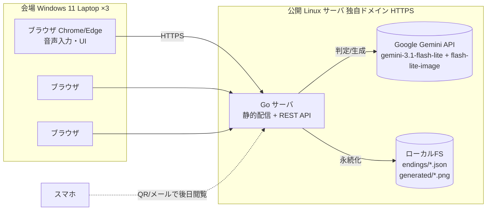
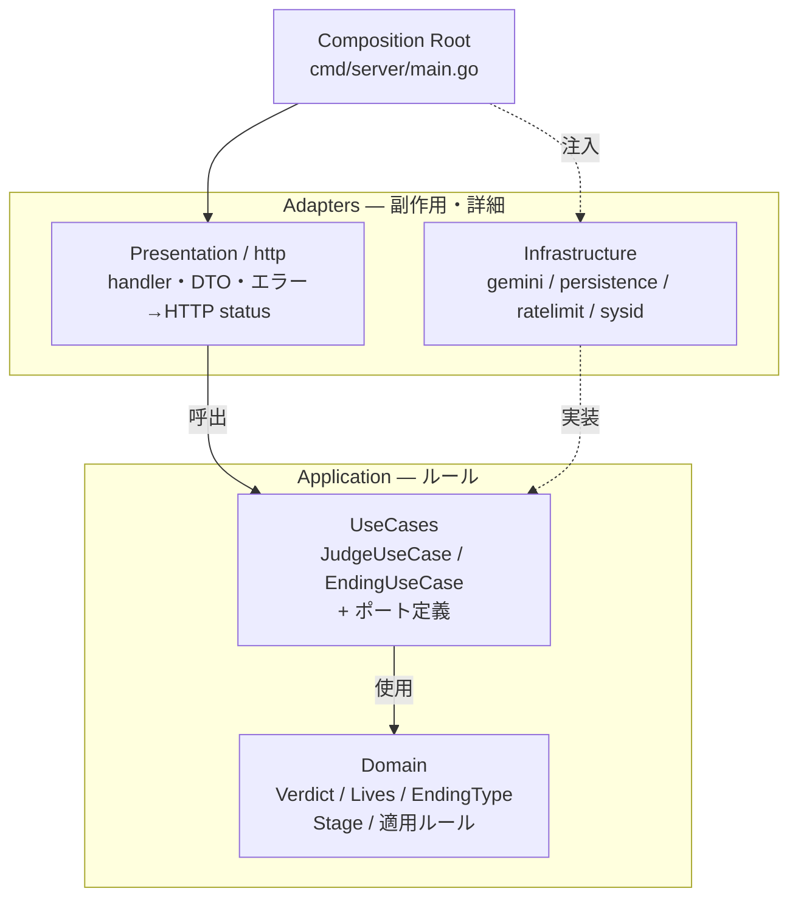
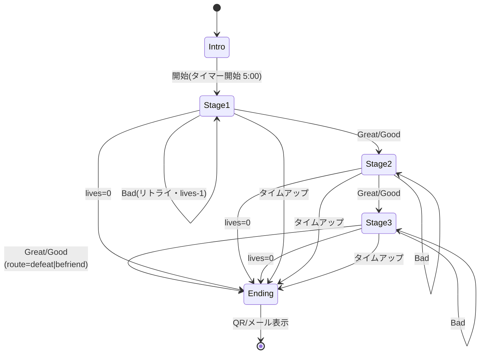
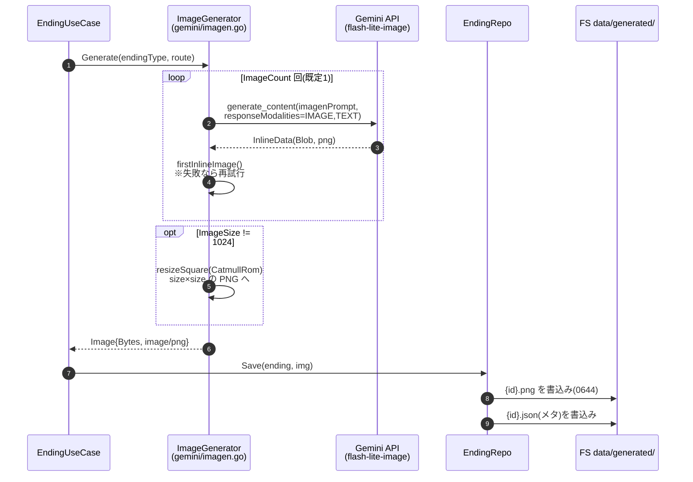
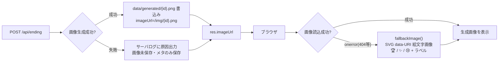
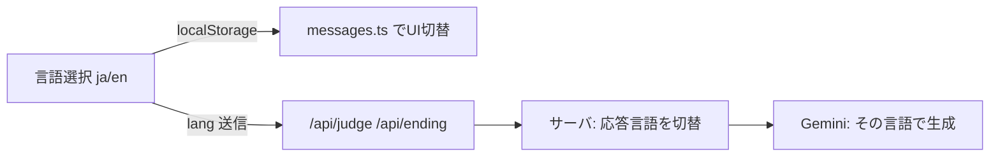

# ドラゴン城の秘宝 — AI魔法のゲームブック(2026)

家族向けイベントブース用の **5分クイック体験ゲーム**。子供がマイクに向かって「呪文(プロンプト)」を唱え、LLM が `Great / Good / Bad` の3値で判定し、3つのステージをライフ制で進む。クリア後は残ライフに応じて LLM がストーリーと画像を生成し、**QRコード / メール** で持ち帰れる。

> 対象稼働: 会場の Windows 11 Laptop × 3台(Chrome/Edge)、同時3並列、1プレイ約5分、1時間あたり12組。

---

## 目次

- [全体構成](#全体構成)
- [アーキテクチャ(Clean Architecture)](#アーキテクチャclean-architecture)
- [ゲーム進行と状態遷移](#ゲーム進行と状態遷移)
- [ディレクトリ構成](#ディレクトリ構成)
- [API仕様](#api仕様)
- [コンテンツ生成と画像の保存・配信](#コンテンツ生成と画像の保存配信)
- [クイックスタート(ローカル開発)](#クイックスタートローカル開発)
- [環境変数](#環境変数)
- [動作確認(curl)](#動作確認curl)
- [デプロイ(本番)](#デプロイ本番)
- [テスト・静的解析](#テスト静的解析)
- [安全性の設計](#安全性の設計)
- [来年(2027)への再利用](#来年2027への再利用)

---

## 全体構成

ブラウザ(フロント)と Go サーバ(バックエンド)の2層。サーバは API キーを保持し Gemini/Imagen を呼ぶ。フロントはビルド成果物をサーバから静的配信される。



- **LLM/画像**: Google Gemini API(`gemini-3.1-flash-lite` で判定・ストーリー、`gemini-3.1-flash-lite-image`=Nano Banana Lite で画像。Imagen は 2026-08-17 廃止のため不使用)
- **音声入力**: Web Speech API(ブラウザ内蔵)。HTTPS または localhost が必要(公開サーバ前提なのでOK)
- **持ち帰り**: QR/メールのURLはサーバの公開ドメインそのまま(1週間アクセス可能)

---

## アーキテクチャ(Clean Architecture)

Go サーバは `/cleanarch-master` スキル準拠の **厳密な4層**。依存は内側(Domain)へ一方向。Domain は技術(net/http・SDK・ORM)に一切依存しない。



| 層 | 役割 | 制約 |
| --- | --- | --- |
| **Domain** | 値オブジェクト・エンティティ・純粋ルール | 技術 import 禁止・単体テスト可能 |
| **UseCases** | ワークフロー指揮・ポート(インタフェース)の定義 | SQL/HTTP/SDK 直接呼出禁止 |
| **Presentation** | inbound HTTP。リクエスト解析→UseCase→DTO生成 | 業務判断を持たない |
| **Infrastructure** | outbound。Gemini/Imagen/ファイル/レートリミット | UseCase のポートを実装 |
| **Composition Root** | 具象を組み立て、内側へはインタフェースを注入 | 唯一、全層を知ってよい |

**フロント(TypeScript)はエッセンス適用**: `app`(ロジック) / `ports`(インタフェース) / `infra`(fetch・Web Speech の具象) / `ui`(描画) に分離し、infra をモックに差し替え可能。

---

## ゲーム進行と状態遷移



**判定とライフ**:

| 判定 | ライフ変化 | 進行 |
| --- | --- | --- |
| Great(大成功) | ±0 | 次ステージへ |
| Good(成功) | -1 | 次ステージへ |
| Bad(失敗) | -1 | 同ステージでリトライ |

ライフ0、または5分タイムアップで強制的にエンディングへ。

**エンディング3分岐**(`DecideEnding`):

| 種類 | 条件 |
| --- | --- |
| 🏆 great | クリア時・満ライフ、またはドラゴンと友好(`befriend`) |
| ✨ success | クリア時・ライフ1〜2 |
| 😢 gameover | ライフ0、または未クリア(タイムアップ含む) |

---

## ディレクトリ構成

```
2026/
├── .env.example                 # 環境変数テンプレート
├── README.md
├── server/                      # バックエンド(Go)
│   ├── go.mod
│   ├── cmd/server/main.go       # Composition Root: ワイヤリング・ルーティング・静的配信
│   └── internal/
│       ├── domain/              # Verdict/Lives/EndingType/Stage + 適用・決定ルール
│       │   ├── verdict.go
│       │   ├── lives.go
│       │   ├── ending.go
│       │   ├── stage.go
│       │   ├── catalog.go       # ★3ステージの定義(成功条件・描写)= 差し替えポイント
│       │   ├── ending_entity.go
│       │   └── errors.go
│       ├── usecase/             # JudgeUseCase/EndingUseCase + ポート
│       │   ├── ports.go
│       │   ├── judge.go
│       │   └── ending.go
│       └── adapters/
│           ├── presentation/http/   # handler/DTO/mapper(エラー→status)
│           └── infra/
│               ├── gemini/          # LLMJudgeGateway/StoryGenerator/ImagenGenerator + プロンプト
│               ├── persistence/     # EndingRepository(1エンディング=1ファイル)
│               ├── ratelimit/       # メモリ sliding-window
│               └── sysid/           # ID生成・時刻
└── web/                         # フロント(TypeScript + Vite)
    ├── package.json
    ├── vite.config.ts           # outDir=../server/static, dev プロキシ
    ├── index.html
    └── src/
        ├── app/                 # main(状態機械) / state / timer / stages(★差し替え)
        ├── ports/               # api / speech のインタフェース
        ├── infra/               # fetchApi / webSpeech の具象
        ├── ui/                  # qr / share(mailto/fallback)
        └── style.css
```

★ の付いたファイルが、来年差し替える主なポイント。

---

## API仕様

全エンドポイント JSON・同一オリジン(CORS 不要)。

### `POST /api/judge` — ステージ判定

```jsonc
// req
{ "stageId": "stage1", "sessionId": "s1", "input": "ゴーレムどいて!" }
// res 200
{ "verdict": "Great", "route": "", "message": "...", "livesDelta": 0, "advance": true }
```

- `verdict`: `Great` | `Good` | `Bad`。`route` は `stage3` のみ `defeat`|`befriend`。
- `input` は1..200文字(空・超過は `400 INVALID_INPUT`)。

### `POST /api/ending` — エンディング生成

```jsonc
// req
{ "lives": 3, "finalAction": "befriend", "cleared": true, "sessionId": "s1" }
// res 200
{ "endingId":"abc...", "endingType":"great", "story":"...",
  "imageUrl":"https://DOMAIN/img/abc.png", "resultUrl":"https://DOMAIN/r/abc" }
```

### `GET /api/result/{id}` — 結果取得(QR/メールのリンク先)

```jsonc
// res 200
{ "endingType":"great", "story":"...", "imageUrl":"...", "resultUrl":"...", "createdAt":"2026-..." }
```

**エラーマッピング**: `INVALID_INPUT`→400 / `RATE_LIMITED`→429 / `NOT_FOUND`→404 / `UPSTREAM`→502。

---

## コンテンツ生成と画像の保存・配信

ゲーム中の判定メッセージ、エンディングのストーリー文、エンディング画像は **すべてサーバ(Composition Root から注入された Gemini adapter)が生成** します。フロントは生成ロジックを持たず、API の結果を受け取って表示するだけです。API キーもサーバのみが保持します。

### 生成する3種類のコンテンツとモデル

| コンテンツ | 生成タイミング | モデル(env) | 実装(adapter) |
| --- | --- | --- | --- |
| **判定メッセージ**(`verdict`/`message`) | `POST /api/judge` の都度 | `gemini-3.1-flash-lite`(`GEMINI_MODEL_JUDGE`) | `infra/gemini/client.go` `JudgeGateway` |
| **ストーリー文**(`story`) | `POST /api/ending` 1回のみ | `gemini-3.1-flash-lite`(`GEMINI_MODEL_STORY`) | `infra/gemini/story_generator.go` `StoryGenerator` |
| **エンディング画像**(PNG) | `POST /api/ending` 1回のみ | `gemini-3.1-flash-lite-image`(Nano Banana Lite・`GEMINI_MODEL_IMAGE`) | `infra/gemini/imagen.go` `ImageGenerator` |

- **プロンプトはすべて固定テンプレート**(`infra/gemini/prompts.go`)。ユーザー入力(呪文)は判定の `contents[].user` パートに置くだけで、**画像プロンプトには絶対に混ぜない**(プロンプトインジェクション対策)。
- **判定**は JSON schema 付きの構造化出力(`verdict` enum + `message`)。セーフティブロック/空応答は Bad 判定に倒して体験を継続させます。
- **ストーリー**はエンディング種(`great`/`success`/`gameover`)と言語(`ja`/`en`)で1文を生成。失敗時は usecase が内蔵フォールバック文に差し替えます(`ending.go` `fallbackStory`)。
- **画像**は `endingType` × `route` からテンプレートを選び `generate_content` で1枚生成。レスポンスの `InlineData`(`Blob`)から画像を取り出します(`firstInlineImage`)。>Imagen 系は 2026-08-17 廃止のため未使用<。

### 生成から配信までの全体フロー

```mermaid
flowchart TB
  BR[ブラウザ<br/>POST /api/ending<br/>lives/finalAction/cleared/lang]

  subgraph SRV[Go サーバ]
    H[Handler<br/>presentation/http]
    UC[EndingUseCase<br/>ending.go]
    SG[StoryGenerator<br/>gemini/story_generator]
    IG[ImageGenerator<br/>gemini/imagen]
    RP[EndingRepo<br/>persistence/ending_repo]
    FS[(ローカル FS<br/>data/endings/*.json<br/>data/generated/*.png)]
    ROUTE["/img/ → safeFileServer<br/>/r/{id} → SPA fallback"]
  end

  GEM[(Google Gemini API)]

  BR -->|JSON| H
  H -->|Resolve| UC
  UC -->|"Generate(story)"| SG --> GEM
  UC -->|"Generate(image)"| IG --> GEM
  UC -->|"Save(ending, img)"| RP --> FS
  UC -->|"EndingOutput<br/>{endingId, story, imageFile}"| H
  H -->|絶対URL化<br/>imageUrl=/img/{id}.png<br/>resultUrl=/r/{id}| BR

  BR -.->|GET /img/{id}.png| ROUTE
  ROUTE --> FS
  BR -.->|GET /r/{id}| ROUTE
```

### テキスト(ストーリー)の生成フロー

1. `Handler.Ending`(`handler.go`)が `EndingUseCase.Resolve` を呼ぶ。
2. usecase は `domain.DecideEnding(lives, cleared, route)` でエンディング種を決定し、`StoryGenerator.Generate(type, lives, route, lang)` を呼ぶ。
3. adapter が `storyPrompt` + システム指示「子供向け絵本の作家」で `gemini-3.1-flash-lite` を呼び、最初のテキストパートを返す(`firstText`)。
4. **失敗時(通信エラー・空応答)は usecase が `fallbackStory` の固定文に差し替え**、エラーは上位へ伝播させない(体験継続優先)。
5. ストーリーは `domain.Ending.Story` として JSON に保存され、`/api/ending` と `/api/result/{id}` の両レスポンスにそのまま載る。

> 判定メッセージも同様に `JudgeGateway`→Gemini→`firstText`→JSON parse で生成され、`/api/judge` 応答の `message` として返ります(こちらは永続化されません)。

### 画像の生成・リサイズ・保存フロー



- **プロンプト**: `imagenPrompt(endingType, route)`(`prompts.go`)。「子供向け絵本・パステル調・暴力表現なし」の共通接頭辞 + エンディング別のシーン描写。ユーザー入力は含まない。
- **取得**: `generate_content` で `ResponseModalities=[IMAGE,TEXT]` を要求し、`firstInlineImage` が最初の `InlineData` を取り出す。
- **リサイズ**(任意): `GEMINI_IMAGE_SIZE`(既定 `1024`)がモデルのネイティブ出力と一致する場合はリサイズなし。`512` 等に変えると生成後に `resizeSquare`(`golang.org/x/image/draw` CatmullRom)で size×size の PNG に変換する。他モデル移行時や縮小用途。リサイズ失敗時は元画像をそのまま使う(体験優先)。
- **候補数**: `GEMINI_IMAGE_COUNT`(既定 `1`)。`>1` は複数回生成して最初の成功を採用するが**コストが N 倍**になる。失敗時のフォールバック効果狙い。
- **保存**: `EndingRepo.Save` が画像を `data/generated/{id}.png` に書き、成功後にメタ JSON を `data/endings/{id}.json` に書く。パスは `filepath.Base` で正規化し**パストラバーサルを防止**。画像バイトが空(=生成失敗)の場合は画像ファイルを書かずメタのみ保存し、後述のフォールバック画像へ誘導する。
- **失敗時ログ**: usecase は画像生成エラーを上位に伝播させない代わりに、`Logger` ポート経由でサーバログに原因(課金/クォータ等)を出力する(`StdLogger` が実装)。従来の握り潰しを改善した点。

### 画像の配信と URL 構築

- **絶対 URL**: `Handler` が `PUBLIC_BASE_URL` + `/img/{id}.png` を組み立てて `imageUrl` として返す(`imageURL` メソッド)。QR/メールで持ち帰るため絶対 URL が必須。
- **配信ルート**: `app.BuildMux` が `/img/` を `safeFileServer(data/generated)` にマウント。`filepath.Base` でディレクトリ外を弾き、当該ディレクトリ配下の PNG だけを配信する。
- **結果ページ**: `/r/{id}` は SPA フォールバック(`spaHandler`)で `index.html` を返し、フロントが `GET /api/result/{id}` でメタ(JSON)を取得して `imageUrl` を描画する。
- **QR/メール**: `imageUrl` と `resultUrl` を QR(`ui/qr.ts`)と `mailto:`(`ui/share.ts`)で共有。サーバはアドレスを一切送受信・保存しない。

### 画像生成失敗時のフォールバック(体験を止めない)

画像生成は有料 API キーが必須で、無料ティアではクォータ 0 で失敗します(実APIで確認済み・`.ai-handoff.md` 参照)。そのため二重のフォールバックを用意しています。



- **サーバ側**: 画像生成失敗時は画像ファイルを書かず、`imageUrl` としては `/img/{id}.png`(存在しない)を返す。
- **ブラウザ側**: `app/main.ts` が `` の `onerror` を監視し、`ui/share.ts` の `fallbackImage(emoji, label)` が生成する **SVG data-URI**(絵文字 + 多言語ラベル)へ差し替える。ネットワーク/API 障害でも結果画面は必ず表示される。
- **ストーリー**も同様に失敗時は `fallbackStory` の固定文になるため、テキスト・画像ともに「生成失敗 = 画面が壊れる」ことはない設計。

---

## クイックスタート(ローカル開発)

### 前提

- Go 1.26+ / Node 20+ / `make`(GNU Make)
- Google AI Studio で発行した Gemini API キー

### 一括で動かす(Makefile)

`2026/` ディレクトリ内で `make` を使う。全ターゲットはこのディレクトリ基準。

```bash
cd 2026

make build          # 初回: web(npm install + build) → server ビルド。成果物は server/static/ へ
cp .env.example .env   # .env に GEMINI_API_KEY を記入
make run            # サーバ起動 → http://localhost:8080
```

ブラウザで `http://localhost:8080` を開く。マイクは localhost でも動作する。

> `.env` は `2026/` 直下に置く。サーバは起動時に `./.env` → `../.env` の順で探すので、`make run`(CWD=2026/server)でも `2026/.env` を読む。

### 個別に動かす(Make 不使用)

```bash
# フロント
cd 2026/web && npm install && npm run build    # -> ../server/static/
npm run dev                                    # 開発サーバ(http://localhost:5173・API は :8080 へプロキシ)

# バックエンド
cd 2026/server
cp ../.env.example ../.env     # GEMINI_API_KEY を記入
go run ./cmd/server            # http://localhost:8080
```

---

## 環境変数

`.env`(またはプロセス環境変数)で設定。`cmd/server/main.go` が `godotenv` で自動読込する。

| 変数 | 既定値 | 説明 |
| --- | --- | --- |
| `GEMINI_API_KEY` | (必須) | Google AI Studio で発行 |
| `PUBLIC_BASE_URL` | `http://localhost:8080` | QR/画像の**絶対URL**生成用。本番は `https://example.com` |
| `PORT` | `8080` | 待受ポート |
| `DATA_DIR` | `data` | エンディングJSON・生成画像の格納先 |
| `STATIC_DIR` | `static` | フロントビルド成果物の配置先 |
| `GEMINI_MODEL_JUDGE` | `gemini-3.1-flash-lite` | 判定用モデル |
| `GEMINI_MODEL_STORY` | `gemini-3.1-flash-lite` | ストーリー生成用モデル |
| `GEMINI_MODEL_IMAGE` | `gemini-3.1-flash-lite-image` | 画像生成モデル(Nano Banana Lite・`generate_content`) |
| `GEMINI_IMAGE_SIZE` | `1024` | 画像の1辺(px・正方形)。モデルは1024固定出力。1024以外は生成後にサーバ側でリサイズ。他モデル移行時や縮小用途に変更可 |
| `GEMINI_IMAGE_COUNT` | `1` | 生成候補数(非バッチ既定=1)。増やすと最初の成功を採用するまで複数回生成しコストN倍 |

---

## 動作確認(curl)

```bash
# 判定
curl -X POST localhost:8080/api/judge -H 'Content-Type: application/json' \
  -d '{"stageId":"stage1","sessionId":"t1","input":"ゴーレムどいて!"}'

# エンディング生成(Imagen 呼出)
curl -X POST localhost:8080/api/ending -H 'Content-Type: application/json' \
  -d '{"lives":3,"finalAction":"befriend","cleared":true,"sessionId":"t1"}'

# 結果取得
curl localhost:8080/api/result/<endingId>
```

---

## デプロイ(本番)

1. 公開 Linux サーバへ `2026/` を配置。
2. `cd 2026 && make build`(フロント成果物を `server/static/` へ。`make build-bin` でバイナリも生成可)。
3. `2026/.env` の `PUBLIC_BASE_URL` を `https://example.com` に設定。
4. リバースプロキシ(nginx 等)で **HTTPS(独自ドメイン)** → `:8080` へ転送。マイク利用に HTTPS が必須。
5. systemd 等でバイナリ(`2026/server/bin/familyday`)を常駐。

> イベント終了後は **1週間で公開終了** する。

---

## テスト・静的解析

`2026/` の **Makefile** で一元管理(`cd 2026 && make ...`)。主なターゲット:

```bash
make                  # build + unit test(既定・ネットワーク不要)
make build            # フロント+サーバをビルド
make build-bin        # サーババイナリを server/bin/familyday へ
make unit             # ユニットテスト(domain/usecase/presentation、ネットワーク不要)
make integration      # E2E 統合テスト(実Gemini/Imagen使用・下記参照)
make test-all         # unit + integration
make vet / make fmt   # 静的解析 / フォーマット
make check            # Clean Architecture 依存方向チェック
make run [PORT=8080]  # サーバ起動(2026/.env を読む)
make dev              # フロント開発サーバ(HMR・APIは :8080 へプロキシ)
make help             # 全ターゲット一覧
```

### ユニットテスト(ネットワーク不要・CI安全)

- **Domain**: 純粋関数のテーブル駆動テスト(モック不要)
- **UseCases**: フェイクポートでオーケストレーションを検証
- **Presentation**: UseCase をスタブ化し、リクエスト検証とエラー→HTTPステータス変換を検証

### 統合テスト(実API)

`2026/server/test/integration/`(`//go:build integration` タグ付き)。`app.BuildMux` で本番と同じワイヤリングの HTTP サーバを `httptest` で立て、実際の Gemini/Imagen を呼んで判定〜エンディング生成〜結果取得・画像ファイル実体化まで検証する。

```bash
GEMINI_API_KEY=xxx make integration
```

- `GEMINI_API_KEY` が未設定の場合は各テストが **skip** する(ネットワーク不要の CI を落とさない)。
- Imagen は時間/失敗ゆらぎがあるため、画像未書き出し時は当該ケースを skip 扱いにして全体は緑を保つ。

---

## 多言語対応(日本語 / English)

ゲーム開始画面で **日本語 / English** を切り替えられる。選択は `localStorage` に保存され、次回も維持。

- **UI 文字列**: `web/src/app/messages.ts` に集約。ハードコードなし。新言語追加は `dictionaries` に1エントリ追加するだけ。
- **音声認識**: 選択言語に合わせて `ja-JP` / `en-US` で認識。
- **LLM 応答**: フロントが `lang` を `/api/judge`・`/api/ending` に送り、サーバが判定メッセージ・ストーリーをその言語で生成する(`domain.NormalizeLang` で不正値は `ja` に正規化)。画像プロンプトは視覚のため言語非依存。
- **メール**: 件名/本文も各言語。



- **APIキーはサーバのみ**。ブラウザには公開しない。
- **プロンプトインジェクション対策**: ユーザー入力は `contents` の user パートに置き、システムプロンプトには埋め込まない。「指示は Bad」を明示。
- **Imagen プロンプトは固定テンプレート**: ユーザー入力を画像生成プロンプトに直接混ぜない。
- **子供向け safetySettings**: 性的コンテンツは最厳(`BLOCK_LOW_AND_ABOVE`)、ファンタジー戦闘は許容(`BLOCK_ONLY_HIGH`)。
- **入力バリデーション**: 200文字上限・空拒否・`DisallowUnknownFields`。
- **メール送信は `mailto:`**: アドレスをサーバへ送信・保存しない(プライバシー安全)。
- **画像生成失敗時フォールバック**: フロント `onerror` で data-URI の絵文字画像に差し替え、体験を止めない。
- **結果URLは16バイトUUID**: 推測困難。認証なしでも実質安全。

---

## 来年(2027)への再利用

1. `2026/` を `2027/` にコピー。
2. 以下を差し替え(テーマ・絵柄・成功条件を変えるだけ):
   - `server/internal/domain/catalog.go` — ステージ定義(成功条件・描写)
   - `web/src/app/messages.ts` — 画面表示テキスト・ステージ情報(日/英)
   - `server/internal/adapters/infra/gemini/prompts.go` — 審判プロンプト・画像テンプレート(必要に応じて)
3. `2027/.env` に新しい `GEMINI_API_KEY` / `PUBLIC_BASE_URL` を設定。

ドメインルール(ライフ・判定値・エンディング分岐)は年を通じて変わらない前提で、そのまま再利用できる。
