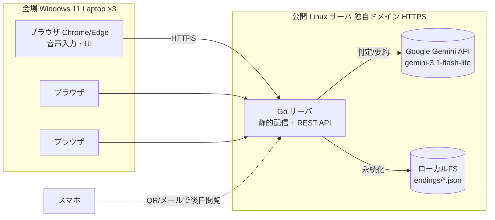
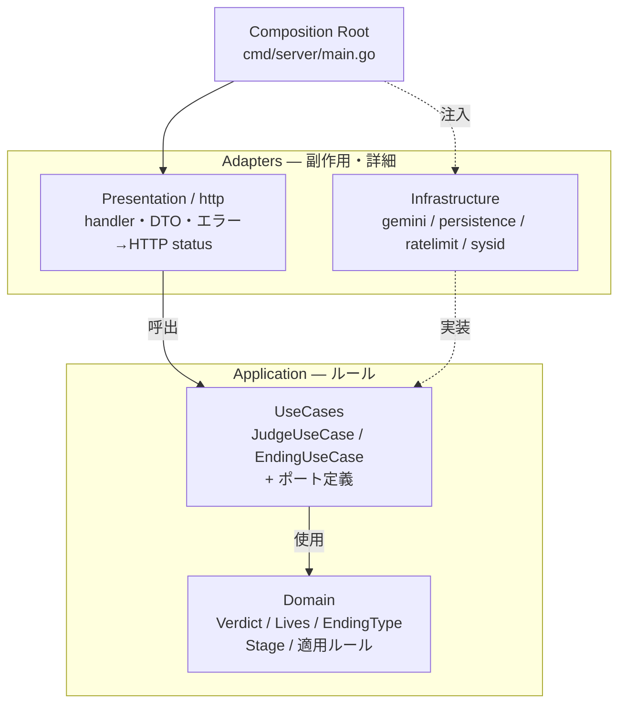
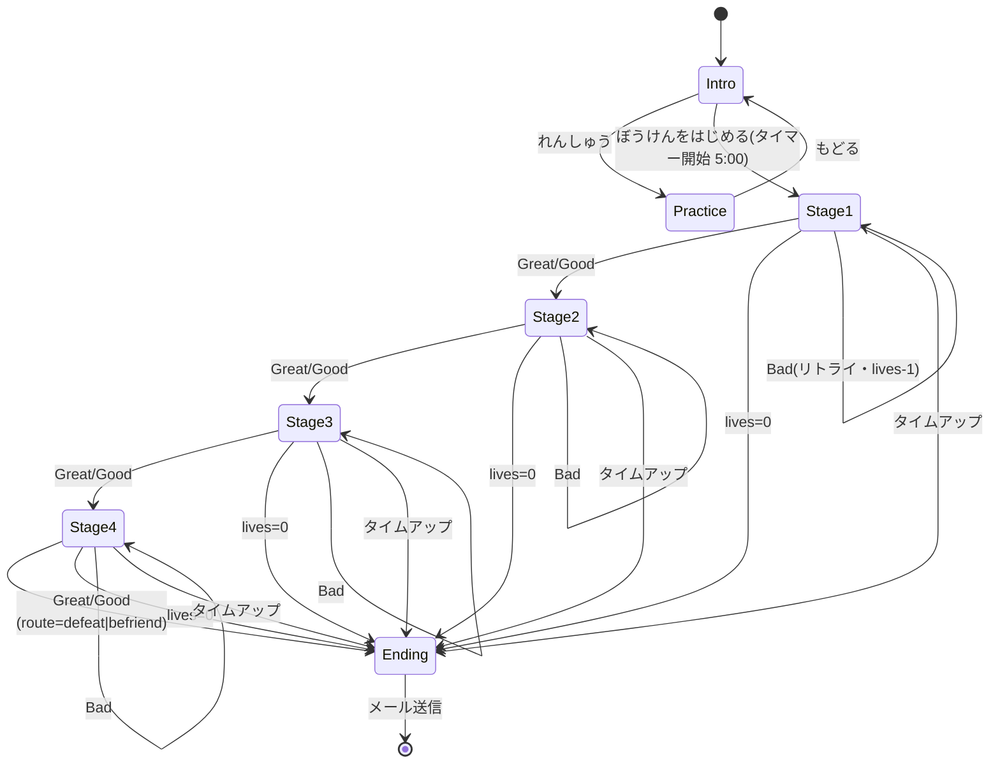
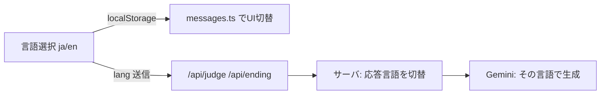

# ドラゴン城の秘宝 — AI魔法のゲームブック(2026)

家族向けイベントブース用の **5分クイック体験ゲーム**。子供がマイクに向かって行動を話し、LLM が `Great / Good / Bad` の3値で判定し、4つのステージをライフ制で進む。クリア後は LLM がエンディング要約を生成し、画像は固定 JPG を表示して **メール** で持ち帰れる。

> 対象稼働: 会場の Windows 11 Laptop × 3台(Chrome/Edge)、同時3並列、1プレイ約5分、1時間あたり12組。

---

## 目次

- [全体構成](#全体構成)
- [アーキテクチャ(Clean Architecture)](#アーキテクチャclean-architecture)
- [ゲーム進行と状態遷移](#ゲーム進行と状態遷移)
- [ディレクトリ構成](#ディレクトリ構成)
- [API仕様](#api仕様)
- [コンテンツ生成と画像の保存・配信](#コンテンツ生成と画像の保存配信)
- [クイックスタート(ローカル開発)](#クイックスタートローカル開発)
- [環境変数](#環境変数)
- [動作確認(curl)](#動作確認curl)
- [デプロイ(本番)](#デプロイ本番)
- [テスト・静的解析](#テスト静的解析)
- [安全性の設計](#安全性の設計)
- [来年(2027)への再利用](#来年2027への再利用)

---

## 全体構成

ブラウザ(フロント)と Go サーバ(バックエンド)の2層。サーバは API キーを保持し Gemini を呼ぶ。フロントはビルド成果物をサーバから静的配信される。



- **LLM**: Google Gemini API(`gemini-3.1-flash-lite` で判定・エンディング要約)
- **画像**: `web/public/images/` の固定 JPG(`s1w-s4w.jpg`, `successfulw.jpg`, `failedw.jpg`, `practicew.jpg`)
- **音声入力**: Web Speech API(ブラウザ内蔵)。HTTPS または localhost が必要(公開サーバ前提なのでOK)
- **持ち帰り**: QR/メールのURLはサーバの公開ドメインそのまま(1週間アクセス可能)

---

## アーキテクチャ(Clean Architecture)

Go サーバは `/cleanarch-master` スキル準拠の **厳密な4層**。依存は内側(Domain)へ一方向。Domain は技術(net/http・SDK・ORM)に一切依存しない。



| 層 | 役割 | 制約 |
| --- | --- | --- |
| **Domain** | 値オブジェクト・エンティティ・純粋ルール | 技術 import 禁止・単体テスト可能 |
| **UseCases** | ワークフロー指揮・ポート(インタフェース)の定義 | SQL/HTTP/SDK 直接呼出禁止 |
| **Presentation** | inbound HTTP。リクエスト解析→UseCase→DTO生成 | 業務判断を持たない |
| **Infrastructure** | outbound。Gemini/ファイル/レートリミット | UseCase のポートを実装 |
| **Composition Root** | 具象を組み立て、内側へはインタフェースを注入 | 唯一、全層を知ってよい |

**フロント(TypeScript)はエッセンス適用**: `app`(ロジック) / `ports`(インタフェース) / `infra`(fetch・Web Speech の具象) / `ui`(描画) に分離し、infra をモックに差し替え可能。

---

## ゲーム進行と状態遷移



**判定とライフ**:

| 判定 | ライフ変化 | 進行 |
| --- | --- | --- |
| Great(大成功) | ±0 | 次ステージへ |
| Good(成功) | -1 | 次ステージへ |
| Bad(失敗) | -1 | 同ステージでリトライ |

ライフ0、または5分タイムアップで強制的にエンディングへ。

### タイムアップ時の処理

`ぼうけんをはじめる` で開始すると 5:00 のカウントダウンが動き、0 になった時点で次の順に処理する。

1. 進行中の遅延遷移を止める
2. 現在の状態を `forceEnding` で `ending` に切り替える
3. マイクと手動送信を無効化し、ラベルを `しゅうりょう` にする
4. セッションを保存する
5. `goEnding()` でエンディングAPIを呼ぶ
6. API 成功時はエンディング要約と固定 JPG を表示する
7. API 失敗時は `failedw.jpg` と通信エラー用の文面を表示する

**エンディング3分岐**(`DecideEnding`):

| 種類 | 条件 |
| --- | --- |
| 🏆 great | クリア時・満ライフ、またはドラゴンと友好(`befriend`) |
| ✨ success | クリア時・ライフ1〜2 |
| 😢 gameover | ライフ0、または未クリア(タイムアップ含む) |

---

## れんしゅうモード

intro画面の「れんしゅう」ボタンから、マイク操作に慣れるための1ステージ練習モードに入ります。

- **状況**: 歩いていると Alice のものとみられるかばんのおとしものがある。遠くに交番が見える。どうする!
- **判定**: フロントの簡易キーワード判定（サーバー・LLM不使用・即時）
  - 交番に届ける系（「こうばん」「とどける」「police」「return」等）→ 成功(緑)
  - 無視して立ち去る系（「むし」「あるく」「ignore」「walk」等）→ 失敗(赤)
  - 否定形（「とどけない」「わたさない」等）は失敗に倒す
- **画像**: `web/public/images/practicew.jpg` を表示
- 「もどる」ボタンでintroに復帰します

---

## ディレクトリ構成

```
2026/
├── .env.example                 # 環境変数テンプレート
├── README.md
├── server/                      # バックエンド(Go)
│   ├── go.mod
│   ├── cmd/server/main.go       # Composition Root: ワイヤリング・ルーティング・静的配信
│   └── internal/
│       ├── domain/              # Verdict/Lives/EndingType/Stage + 適用・決定ルール
│       │   ├── verdict.go
│       │   ├── lives.go
│       │   ├── ending.go
│       │   ├── stage.go
│       │   ├── catalog.go       # ★4ステージの定義(成功条件・描写)= 差し替えポイント
│       │   ├── ending_entity.go
│       │   └── errors.go
│       ├── usecase/             # JudgeUseCase/EndingUseCase + ポート
│       │   ├── ports.go
│       │   ├── judge.go
│       │   └── ending.go
│       └── adapters/
│           ├── presentation/http/   # handler/DTO/mapper(エラー→status)
│           └── infra/
│               ├── gemini/          # LLMJudgeGateway/StoryGenerator + プロンプト
│               ├── persistence/     # EndingRepository(1エンディング=1ファイル)
│               ├── ratelimit/       # メモリ sliding-window
│               └── sysid/           # ID生成・時刻
└── web/                         # フロント(TypeScript + Vite)
    ├── package.json
    ├── vite.config.ts           # outDir=../server/static, dev プロキシ
    ├── index.html
    └── src/
        ├── app/                 # main(状態機械) / state / timer / stages(★差し替え)
        ├── ports/               # api / speech のインタフェース
        ├── infra/               # fetchApi / webSpeech の具象
        ├── ui/                  # qr / share(mailto/fallback)
        └── style.css
```

★ の付いたファイルが、来年差し替える主なポイント。

---

## API仕様

全エンドポイント JSON・同一オリジン(CORS 不要)。

### `POST /api/judge` — ステージ判定

```jsonc
// req
{ "stageId": "stage1", "sessionId": "s1", "input": "ゴーレムどいて!" }
// res 200
{ "verdict": "Great", "route": "", "message": "...", "livesDelta": 0, "advance": true }
```

- `verdict`: `Great` | `Good` | `Bad`。`route` は `stage4` のみ `defeat`|`befriend`。
- `input` は1..200文字(空・超過は `400 INVALID_INPUT`)。

### `POST /api/ending` — エンディング生成

```jsonc
// req
{ "lives": 3, "finalAction": "befriend", "cleared": true, "sessionId": "s1" }
// res 200
{ "endingId":"abc...", "endingType":"great", "story":"...",
  "imageUrl":"https://DOMAIN/images/successfulw.jpg", "resultUrl":"https://DOMAIN/r/abc" }
```

### `GET /api/result/{id}` — 結果取得(QR/メールのリンク先)

```jsonc
// res 200
{ "endingType":"great", "story":"...", "imageUrl":"...", "resultUrl":"...", "createdAt":"2026-..." }
```

**エラーマッピング**: `INVALID_INPUT`→400 / `RATE_LIMITED`→429 / `NOT_FOUND`→404 / `UPSTREAM`→502。

---

## コンテンツ生成と画像の保存・配信

ゲーム中の判定メッセージとエンディングの要約文はサーバ側の Gemini adapter が生成します。画像は生成せず、`web/public/images/` の固定 JPG をフロントと API が参照します。

### 生成する2種類のコンテンツとモデル

| コンテンツ | 生成タイミング | モデル(env) | 実装(adapter) |
| --- | --- | --- | --- |
| **判定メッセージ**(`verdict`/`message`) | `POST /api/judge` の都度 | `gemini-3.1-flash-lite`(`GEMINI_MODEL_JUDGE`) | `infra/gemini/client.go` `JudgeGateway` |
| **エンディング要約**(`story`) | `POST /api/ending` 1回のみ | `gemini-3.1-flash-lite`(`GEMINI_MODEL_STORY`) | `infra/gemini/story_generator.go` `StoryGenerator` |

- **プロンプトはすべて固定テンプレート**(`infra/gemini/prompts.go`)。ユーザー入力は判定の `contents[].user` パートに置き、システム指示には埋め込まない。
- **判定**は JSON schema 付きの構造化出力(`verdict` enum + `message`)。セーフティブロック/空応答は Bad 判定に倒して体験を継続させます。
- **要約**は `state.history` と最終結果から 1〜2 文で生成し、失敗時は usecase が内蔵フォールバック文に差し替えます(`ending.go` `fallbackStory`)。
- **画像**は生成せず、`/images/s1w.jpg`〜`/images/successfulw.jpg` / `failedw.jpg` を参照します。

### 生成から配信までの全体フロー

```mermaid
flowchart TB
  BR[ブラウザ<br/>POST /api/ending<br/>lives/finalAction/cleared/lang/history]

  subgraph SRV[Go サーバ]
    H[Handler<br/>presentation/http]
    UC[EndingUseCase<br/>ending.go]
    SG[StoryGenerator<br/>gemini/story_generator]
    RP[EndingRepo<br/>persistence/ending_repo]
    FS[(ローカル FS<br/>data/endings/*.json)]
    STATIC[(固定 JPG<br/>server/static/images/*w.jpg)]
  end

  GEM[(Google Gemini API)]

  BR -->|JSON| H
  H -->|Resolve| UC
  UC -->|"Generate(story)"| SG --> GEM
  UC -->|"Save(ending)"| RP --> FS
  UC -->|"EndingOutput<br/>{endingId, story}"| H
  H -->|絶対URL化<br/>imageUrl=/images/{successful|failed}w.jpg<br/>resultUrl=/r/{id}| BR
  BR -.->|GET /images/*w.jpg| STATIC
  BR -.->|GET /r/{id}| H
```

### テキスト(ストーリー)の生成フロー

1. `Handler.Ending`(`handler.go`)が `EndingUseCase.Resolve` を呼ぶ。
2. usecase は `domain.DecideEnding(lives, cleared, route)` でエンディング種を決定し、`StoryGenerator.Generate` に `state.history` と最終結果を渡す。
3. adapter が `storyPrompt` + システム指示「子供向け絵本の作家」で `gemini-3.1-flash-lite` を呼び、最初のテキストパートを返す(`firstText`)。
4. 失敗時(通信エラー・空応答)は usecase が `fallbackStory` の固定文に差し替え、エラーは上位へ伝播させない(体験継続優先)。
5. ストーリーは `domain.Ending.Story` として JSON に保存され、`/api/ending` と `/api/result/{id}` の両レスポンスにそのまま載る。

> 判定メッセージも同様に `JudgeGateway`→Gemini→`firstText`→JSON parse で生成され、`/api/judge` 応答の `message` として返ります(こちらは永続化されません)。

### 画像配信と URL 構築

- **絶対 URL**: `Handler` が `PUBLIC_BASE_URL` + `/images/successfulw.jpg` または `/images/failedw.jpg` を組み立てて `imageUrl` として返す。
- **配信ルート**: `server/static/images/` に置いた JPG をそのまま配信する。画像生成や `generated/` ディレクトリは使いません。
- **結果ページ**: `/r/{id}` は SPA フォールバック(`spaHandler`)で `index.html` を返し、フロントが `GET /api/result/{id}` でメタ(JSON)を取得して `imageUrl` を描画する。
- **メール**: `imageUrl` と `resultUrl` を `mailto:`(`ui/share.ts`)で共有。サーバはアドレスを一切送受信・保存しない。

---

## クイックスタート(ローカル開発)

### 前提

- Go 1.26+ / Node 20+ / `make`(GNU Make)
- Google AI Studio で発行した Gemini API キー

### 一括で動かす(Makefile)

`2026/` ディレクトリ内で `make` を使う。全ターゲットはこのディレクトリ基準。

```bash
cd 2026

make build          # 初回: web(npm install + build) → server ビルド。成果物は server/static/ へ
cp .env.example .env   # .env に GEMINI_API_KEY を記入
make run            # サーバ起動 → http://localhost:8080
```

ブラウザで `http://localhost:8080` を開く。マイクは localhost でも動作する。

> `.env` は `2026/` 直下に置く。サーバは起動時に `./.env` → `../.env` の順で探すので、`make run`(CWD=2026/server)でも `2026/.env` を読む。

### 個別に動かす(Make 不使用)

```bash
# フロント
cd 2026/web && npm install && npm run build    # -> ../server/static/
npm run dev                                    # 開発サーバ(http://localhost:5173・API は :8080 へプロキシ)

# バックエンド
cd 2026/server
cp ../.env.example ../.env     # GEMINI_API_KEY を記入
go run ./cmd/server            # http://localhost:8080
```

---

## 環境変数

`.env`(またはプロセス環境変数)で設定。`cmd/server/main.go` が `godotenv` で自動読込する。

| 変数 | 既定値 | 説明 |
| --- | --- | --- |
| `GEMINI_API_KEY` | (必須) | Google AI Studio で発行 |
| `PUBLIC_BASE_URL` | `http://localhost:8080` | QR/画像の**絶対URL**生成用。本番は `https://example.com` |
| `PORT` | `8080` | 待受ポート |
| `DATA_DIR` | `data` | エンディングJSON・生成画像の格納先 |
| `STATIC_DIR` | `static` | フロントビルド成果物の配置先 |
| `GEMINI_MODEL_JUDGE` | `gemini-3.1-flash-lite` | 判定用モデル |
| `GEMINI_MODEL_STORY` | `gemini-3.1-flash-lite` | エンディング要約用モデル |

---

## 動作確認(curl)

```bash
# 判定
curl -X POST localhost:8080/api/judge -H 'Content-Type: application/json' \
  -d '{"stageId":"stage1","sessionId":"t1","input":"ゴーレムどいて!"}'

# エンディング生成
curl -X POST localhost:8080/api/ending -H 'Content-Type: application/json' \
  -d '{"lives":3,"finalAction":"befriend","cleared":true,"sessionId":"t1"}'

# 結果取得
curl localhost:8080/api/result/<endingId>
```

---

## デプロイ(本番)

1. 公開 Linux サーバへ `2026/` を配置。
2. `cd 2026 && make build` を実行して、フロント成果物を `server/static/` に生成する。
3. `cd 2026 && make build-bin` を実行して、サーババイナリ `server/bin/familyday` を生成する。
4. 本番サーバでは、少なくとも次の3点を同じ作業ディレクトリに置く。
   - `familyday` バイナリ
   - `static/` ディレクトリ
   - `.env`
5. 例として `/opt/familyday/` に配置するなら、次のように置く。
   - `/opt/familyday/familyday`
   - `/opt/familyday/static/`
   - `/opt/familyday/.env`
6. `.env` の `PUBLIC_BASE_URL` を本番ドメインに設定する。
7. systemd で `familyday` を常駐させる。`WorkingDirectory` は配置先ディレクトリ、`ExecStart` は `./familyday` にする。
8. リバースプロキシ(nginx 等)で **HTTPS(独自ドメイン)** → `127.0.0.1:8080` へ転送する。マイク利用に HTTPS が必須。

> イベント終了後は **1週間で公開終了** する。

### systemd 例

```ini
[Unit]
Description=familyday
After=network-online.target

[Service]
WorkingDirectory=/opt/familyday
EnvironmentFile=/opt/familyday/.env
ExecStart=/opt/familyday/familyday
Restart=always
RestartSec=3
User=familyday
Group=familyday

[Install]
WantedBy=multi-user.target
```

### 配置手順の要点

```bash
cd 2026
make build
make build-bin
sudo mkdir -p /opt/familyday
sudo cp server/bin/familyday /opt/familyday/
sudo cp -r server/static /opt/familyday/
sudo cp .env /opt/familyday/
sudo chown -R familyday:familyday /opt/familyday
```

`make build-bin` はバイナリのみを作るため、`server/static/` は `make build` で別途生成して一緒に配置する。

---

## テスト・静的解析

`2026/` の **Makefile** で一元管理(`cd 2026 && make ...`)。主なターゲット:

```bash
make                  # build + unit test(既定・ネットワーク不要)
make build            # フロント+サーバをビルド
make build-bin        # サーババイナリを server/bin/familyday へ
make unit             # ユニットテスト(domain/usecase/presentation、ネットワーク不要)
make integration      # E2E 統合テスト(実Gemini使用・下記参照)
make test-all         # unit + integration
make vet / make fmt   # 静的解析 / フォーマット
make check            # Clean Architecture 依存方向チェック
make run [PORT=8080]  # サーバ起動(2026/.env を読む)
make dev              # フロント開発サーバ(HMR・APIは :8080 へプロキシ)
make help             # 全ターゲット一覧
```

### ユニットテスト(ネットワーク不要・CI安全)

- **Domain**: 純粋関数のテーブル駆動テスト(モック不要)
- **UseCases**: フェイクポートでオーケストレーションを検証
- **Presentation**: UseCase をスタブ化し、リクエスト検証とエラー→HTTPステータス変換を検証

### 統合テスト(実API)

`2026/server/test/integration/`(`//go:build integration` タグ付き)。`app.BuildMux` で本番と同じワイヤリングの HTTP サーバを `httptest` で立て、実際の Gemini を呼んで判定〜エンディング生成〜結果取得まで検証する。

```bash
GEMINI_API_KEY=xxx make integration
```

- `GEMINI_API_KEY` が未設定の場合は各テストが **skip** する(ネットワーク不要の CI を落とさない)。

---

## 多言語対応(日本語 / English)

ゲーム開始画面で **日本語 / English** を切り替えられる。選択は `localStorage` に保存され、次回も維持。

- **UI 文字列**: `web/src/app/messages.ts` に集約。ハードコードなし。新言語追加は `dictionaries` に1エントリ追加するだけ。
- **音声認識**: 選択言語に合わせて `ja-JP` / `en-US` で認識。
- **LLM 応答**: フロントが `lang` を `/api/judge`・`/api/ending` に送り、サーバが判定メッセージ・ストーリーをその言語で生成する(`domain.NormalizeLang` で不正値は `ja` に正規化)。画像プロンプトは視覚のため言語非依存。
- **メール**: 件名/本文も各言語。



- **APIキーはサーバのみ**。ブラウザには公開しない。
- **プロンプトインジェクション対策**: ユーザー入力は `contents` の user パートに置き、システムプロンプトには埋め込まない。「指示は Bad」を明示。
- **子供向け safetySettings**: 性的コンテンツは最厳(`BLOCK_LOW_AND_ABOVE`)、ファンタジー戦闘は許容(`BLOCK_ONLY_HIGH`)。
- **入力バリデーション**: 200文字上限・空拒否・`DisallowUnknownFields`。
- **メール送信は `mailto:`**: アドレスをサーバへ送信・保存しない(プライバシー安全)。
- **画像配信は固定 JPG**: `web/public/images/` の `s1-s4 / successful / failed / practice` をそのまま配信する。画像生成や `onerror` の差し替えは使わない。
- **結果URLは16バイトUUID**: 推測困難。認証なしでも実質安全。

---

## 来年(2027)への再利用

1. `2026/` を `2027/` にコピー。
2. 以下を差し替え(テーマ・絵柄・成功条件を変えるだけ):
   - `server/internal/domain/catalog.go` — ステージ定義(成功条件・描写)
   - `web/src/app/messages.ts` — 画面表示テキスト・ステージ情報(日/英)
   - `server/internal/adapters/infra/gemini/prompts.go` — 審判プロンプト・画像テンプレート(必要に応じて)
3. `2027/.env` に新しい `GEMINI_API_KEY` / `PUBLIC_BASE_URL` を設定。

ドメインルール(ライフ・判定値・エンディング分岐)は年を通じて変わらない前提で、そのまま再利用できる。
